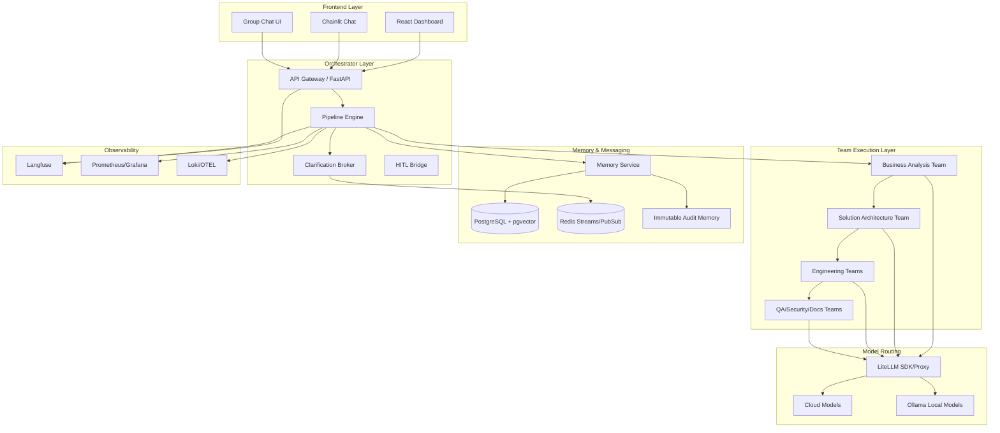
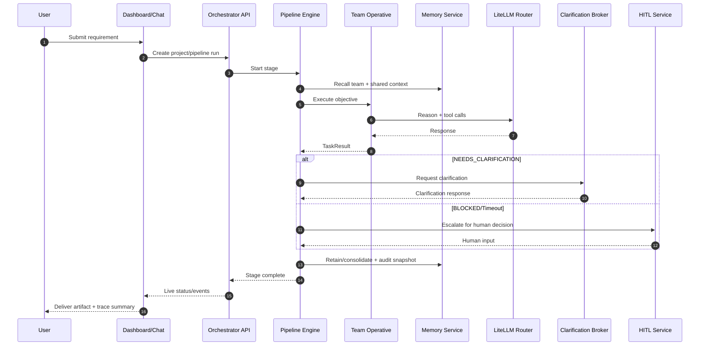
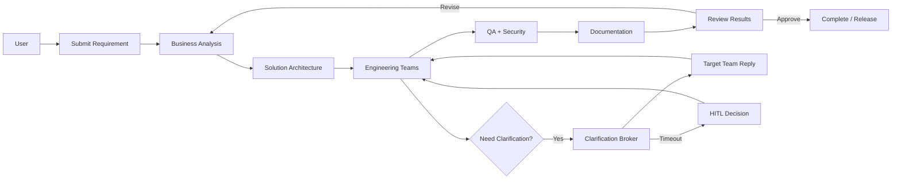

# AI Software Factory — Consolidated Technical Plan

_Last updated: 2026-02-21_

## 1) Purpose
This document consolidates the full architecture planning data from the prior design session and translates it into an implementation-ready plan for this repository.

Primary goals:
- End-to-end AI-driven software delivery with specialized **teams** (not "crews").
- Strong guardrails, confidence gating, and inter-team clarification.
- Hybrid model routing (cloud + local fallback).
- Memory architecture with auditability and operational observability.

---

## 2) Final Terminology (standardized)
To avoid overloaded framework terms, use this project lexicon:

- **Factory**: The full platform.
- **Team**: A specialized SDLC function group.
- **Operative**: A single role agent within a team.
- **Objective**: A bounded task unit with acceptance criteria.
- **Stage**: One pipeline handoff step.
- **Pipeline**: Ordered sequence of stages over project state.

---

## 3) High-Level Architecture

### 3.1 Core Services
- **Orchestrator service** (FastAPI): runs pipelines, emits events, manages project state.
- **Chat service** (Chainlit): operator interaction and team visibility.
- **Group chat service** (AutoGen selector-style): structured multi-agent/team collaboration.
- **Memory service**: centralized memory read/write gateway.
- **HITL service**: escalations, approvals, and blocked workflow resolution.
- **Frontend dashboard** (React): graph, events, settings, cost/usage, memory views.

### 3.2 Data & Runtime Plane
- PostgreSQL + pgvector + PgBouncer (transaction mode).
- Redis Streams + Pub/Sub for event transport and clarifications.
- Ollama for local models and embeddings.
- LiteLLM (SDK first, Proxy later) for routing, policy, usage, and fallback orchestration.

### 3.3 Observability Plane
- Langfuse traces and model/tool callbacks.
- Prometheus + Grafana dashboards.
- Loki logging + OTEL collector.
- Optional incident/error pipeline (GlitchTip-like integration).

### 3.4 Technical Architecture Diagram

### 3.5 Runtime Sequence (Objective Execution)

---

## 4) Team Topology (17 teams)

1. Product Management  
2. Solution Architecture  
3. Feature Engineering  
4. Frontend Engineering  
5. Backend Engineering  
6. Database Engineering  
7. DevOps / Infrastructure  
8. QA Engineering  
9. Security Engineering  
10. Data Engineering  
11. ML Engineering  
12. API Design  
13. Documentation  
14. Business Analysis  
15. UX / UI Design  
16. Compliance & Legal  
17. SRE / Operations

Shared cross-team memory bank: `factory-shared-world`.

---

## 5) Model Routing Strategy

### 5.1 Canonical aliases
- `factory/architect` → strong reasoning model (cloud), fallback local large model.
- `factory/coder` → strong coding model (cloud), fallback local coder model.
- `factory/fast` → low-latency model for operational loops.
- `factory/cheap` → cost-optimized model for extraction/summaries.
- `local/embed` → local embedding model.

### 5.2 Fallback policy
- Retry chain: **cloud → local** for transient failures/rate limits.
- Phase 1 via SDK mode; Phase 2 enables centralized Proxy mode with budget policy.

---

## 6) Memory Architecture (3-layer stack)

### 6.1 Live team memory
- Library role: retrieval + temporal context + bank-level organization.
- Used at each stage for recall and context packing.

### 6.2 Team-native memory hook
- Library role: fact extraction/dedup through native integration at team execution boundary.

### 6.3 Immutable session audit memory
- Library role: append-only session snapshots and replay search for compliance/debug.

### 6.4 Context packing policy
- Keep original objective anchor always present.
- Inject team mental model + bounded recall.
- Apply compression at ~80% context utilization.
- On compression trigger: retain batch → consolidate → refresh mental model → truncate active buffer.

---

## 7) Confidence Gate (universal)
Every team objective returns a structured `TaskResult`:

- `status`: `COMPLETE | NEEDS_CLARIFICATION | BLOCKED`
- `reasoning`
- `blockers`
- `assumptions_made`
- `verified_facts`
- `clarification_needed`

Guardrail rules:
- Non-`COMPLETE` states trigger either clarification workflow or escalation.
- Retry budget is bounded.
- Iteration count is capped to prevent loops.

---

## 8) Inter-Team Clarification Protocol

### 8.1 Trigger
When an operative/team cannot continue with confidence, it issues `request_clarification(target_team, question)`.

### 8.2 Broker behavior
- Writes request to team stream.
- Target team responder resolves question as a focused objective.
- Reply is returned through keyed response with TTL.

### 8.3 Safety controls
- Max clarification requests per objective.
- Max hop depth to avoid ping-pong cycles.
- No self-routing loops.
- Timeout falls back to HITL escalation.

---

## 9) Frontend / UX Plan

### 9.1 Dashboard capabilities
- Pipeline graph with team grouping and live status.
- Activity feed (WebSocket) for model/tool events.
- Chat panel embedding.
- Settings page for model keys, routing, and budget controls.
- Cost and memory views for operations.

### 9.2 Graph behavior
- Team nodes + operative nodes.
- Clarification edges rendered distinctly.
- Event batching at UI frame-friendly rate for smooth visualization.

### 9.3 User Workflow (end-to-end)

#### Workflow A — New Product Requirement to Working Delivery
1. User submits idea/requirement from dashboard or chat.
2. Business Analysis Team structures scope, constraints, and success criteria.
3. Solution Architecture Team produces architecture + ADR decisions.
4. Engineering teams implement features and integration artifacts.
5. QA/Security teams validate quality gates and risk controls.
6. Documentation Team generates release documentation.
7. User reviews outputs, accepts, or requests changes.

#### Workflow B — Clarification Loop During Execution
1. A team returns `NEEDS_CLARIFICATION` with question context.
2. Broker routes to target team and waits for bounded response.
3. If unresolved by policy/timeout, request escalates to HITL.
4. Human response is fed back to blocked stage.
5. Pipeline resumes from the blocked objective.

#### Workflow C — Operations & Governance
1. User monitors live run status, costs, and model usage.
2. User adjusts model routing/budgets in settings.
3. User inspects memory/audit snapshots and event traces.
4. User triggers retry/rollback/escalation decisions when needed.

### 9.4 User Workflow Diagram

---

## 10) Phase Plan (delivery roadmap)

## Phase 1 — MVP Core (Weeks 1–8)
Goal: 5-team sequential pipeline with memory, guardrails, and baseline chat.

Deliverables:
1. Compose baseline: Postgres/PgBouncer, Redis, Ollama, core services.
2. LiteLLM SDK routing aliases and fallback policy.
3. Memory service + per-team bank wiring.
4. `TaskResult` confidence gate for active Phase 1 teams.
5. Sequential pipeline: Business Analysis → Solution Architecture → Backend Engineering → QA Engineering → Documentation.
6. Team-native memory hook on each active team.
7. Team identity docs per active team (`SOUL.md`, `AGENTS.md`, `TOOLS.md`).
8. Initial Tool Registry and essential tool set.
9. Chainlit profile for direct team interaction.
10. Immutable session audit write at pipeline end.
11. Langfuse-first instrumentation.
12. Basic React status dashboard.

Exit criteria:
- One complete pipeline execution with traceability and audit snapshot.
- No unbounded loops; clarification and blocker states handled safely.

## Phase 2 — Full Factory Expansion (Weeks 9–18)
Goal: full 17-team system + clarification fabric + richer UI + proxy routing.

Deliverables:
13. Add remaining 12 teams and objective templates.
14. Expand pipeline to full 17-stage sequence.
15. Clarification broker + responders for all teams.
16. Clarification tool in all teams with limits and cycle protections.
17. Team mental models and directive policies.
18. Rolling memory compression and refresh.
19. LiteLLM Proxy with per-team budgets/keys.
20. Group-chat service for structured multi-team collaboration.
21. Additional chat profiles: Group Chat + Project Q&A.
22. Graph-first React view with clarification edges.
23. HITL input bridge for blocked runtime prompts.

Exit criteria:
- Full 17-team run works with bounded clarification loops.
- Proxy-level model governance and usage visibility active.

## Phase 3 — Production Hardening (Weeks 19–26)
Goal: enterprise reliability, security, observability, and cost control.

Deliverables:
24. Expand to full 60+ tool matrix across teams.
25. Clarification internals upgrade for lower-latency future-based orchestration.
26. Security CI pipeline (parallel scanners + artifact reporting).
27. Ephemeral PR preview environments.
28. Full observability suite and alerting.
29. Dedicated LLM cost dashboard with team-level spend breakdown.
30. Per-session sandbox policy/toggles by team type and environment.

Exit criteria:
- Repeatable secure release workflow.
- Full telemetry and spend governance operational.

---

## 11) Implementation Plan (execution order)

### 11.1 Documentation-first order
1. Root architecture and standards docs.
2. Service contracts and interfaces.
3. Team definitions + objectives + guardrails.
4. Data contracts and schema specs.
5. Runtime/deployment runbooks.

### 11.2 Build order after docs
1. Infrastructure baseline.
2. Orchestrator + memory + chat backbone.
3. Phase 1 teams and objectives.
4. Clarification protocol.
5. Frontend graph and activity stream.
6. Full team expansion.
7. Security/observability hardening.

### 11.3 Governance checkpoints
- End of each phase: architecture review, cost review, security review, and rollback plan validation.

---

## 12) Key Decisions Captured
1. Use **teams** terminology as standard project language.
2. Use open-source-first integrations where feasible.
3. Use Ollama as local model baseline (LM Studio optional dev sidecar only if needed).
4. Use memory layering (live + native hook + immutable audit) instead of ultra-short brittle summaries.
5. Build observability before scaling team count.
6. Keep all critical loops bounded (iterations, clarification depth, retries).

---

## 13) Prior Research Inputs (captured)

External references reviewed in prior planning and reflected in this plan:
- Overstory patterns (operational resilience and process rigor concepts).
- OpenUsage evaluation (tracked as informative; not primary token telemetry backend for this architecture).
- OpenClaw patterns (team identity docs pattern and practical runtime conventions).
- Memory ecosystem review (hindsight + mem0 + memvid layering rationale).

Adoption summary:
- **Adopted**: team identity docs pattern, clarification safety limits, observability-first posture, phased rollout.
- **Partially adopted**: group collaboration runtime patterns via dedicated service.
- **Not adopted as core**: tooling meant for different runtime assumptions or narrow usage scopes.

---

## 14) Immediate Next Step
Proceed with **Phase 1 scaffolding** in this repository after approval of this document:
- Create service skeletons.
- Add baseline config/contracts.
- Implement first 5-team pipeline with confidence gates and memory wiring.

