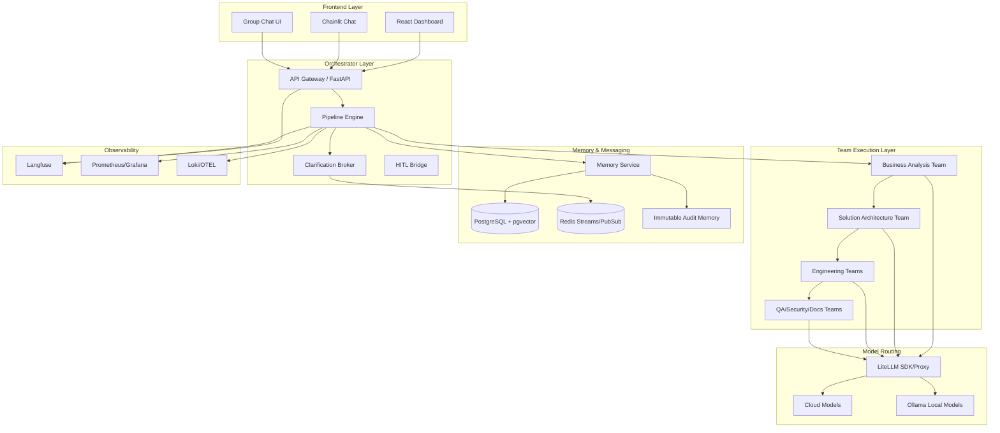
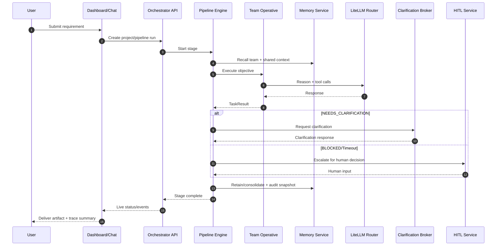
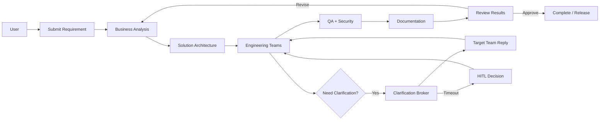
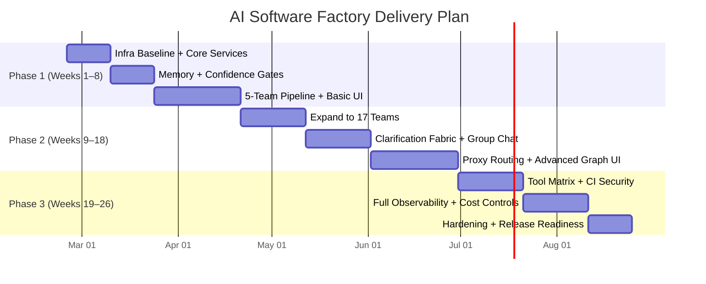
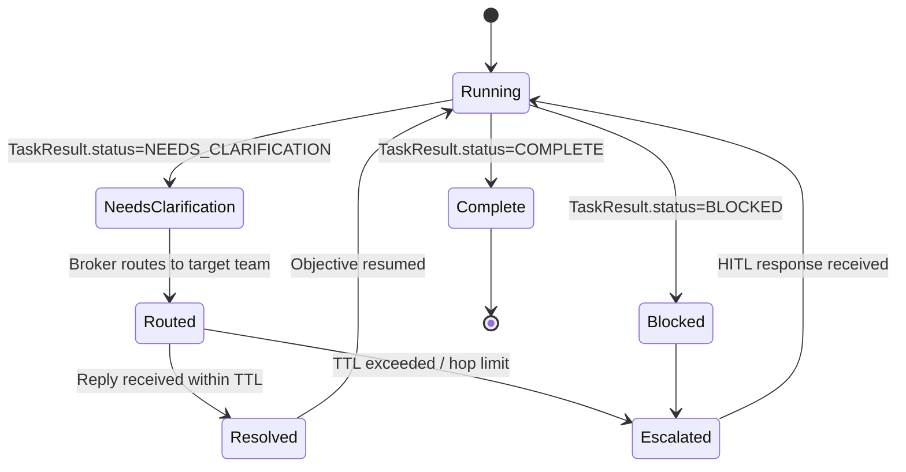
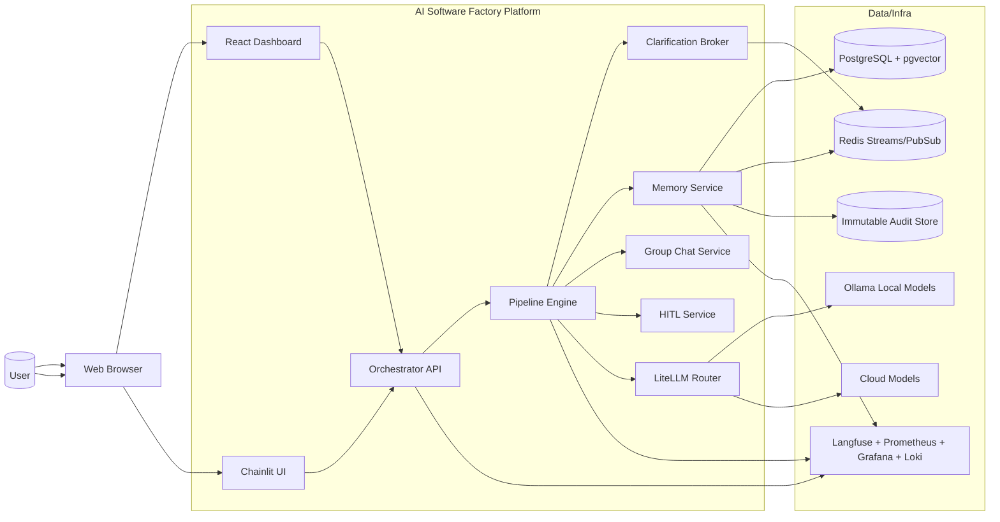
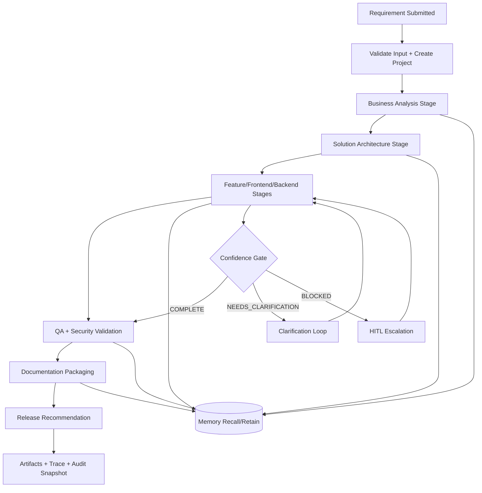

# AI Software Factory — Mermaid Designs

This file contains standalone Mermaid diagrams for architecture, runtime flow, user workflow, and phased delivery.

## 0) How to View

- Open this file in VS Code.
- Use Markdown preview (Cmd+Shift+V) to render diagrams.
- If preview is split, use Cmd+K then V.

## 1) System Architecture (Layered)

## 2) Runtime Sequence (Objective Execution)

## 3) End-to-End User Workflow

## 4) Phase Delivery Timeline

## 5) Clarification Protocol State Flow

## 6) Container-Level Architecture (C4-style)

## 7) Data Flow (Requirement to Release)

